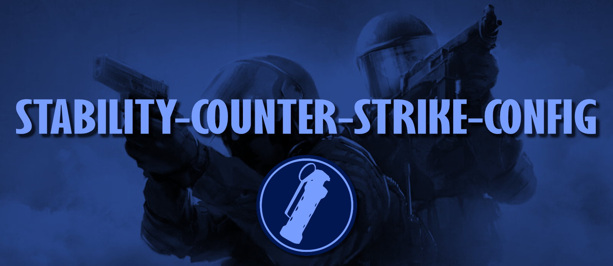

This project is a collection of advanced and customizable configuration scripts designed to enhance your gameplay experience in Counter-Strike 2. These scripts are designed to work with the latest version of CS2 and are compatible with both official Valve servers and most community servers.

# Features
#### **Comprehensive Documentation**:
> The `autoexec.cfg` file includes detailed comments explaining what each bind and command does.   
> A full list of keybinds can also be found here on GitHub, making it easy to find anything.

#### **Easy Installation**:
> Installation is made simple through the use of a Python script that automates the whole process.  
> The installation process also includes options to customize common configuration settings.
  
#### **Extensively Tested**:
> All configurations have been thoroughly tested to ensure stability and performance.   
> Please report any issues or errors by opening an issue here on GitHub.

# Keybinds
Check out all the default [Keybinds](https://github.com/7eventy7/STABILITY-COUNTER-STRIKE-CONFIG/blob/main/KEYBINDS.md) available in this config by reviewing the `autoexec.cfg` file.

> It's a good idea to review the keybinds before changing them during installation.     
> Failing to do so can result in overwriting keybinds and causing various issues.

# Installation

## Windows 
1. Download and install [Python 3.0+](https://www.python.org/downloads/) for Windows.
2. Download the latest release of `install-cs-stability-config.py` from the releases page.
3. Right-click `install-cs-stability-config.py` > Open with > Python.
4. Follow the installation prompts and enjoy!

## Linux
1. Install Python 3.0+ using your package manager. For example, on Debian-based systems:
    ```bash
    sudo apt update
    sudo apt install python3
    ```
2. Download the latest release of `install-cs-stability-config.py`:
    ```bash
    wget https://github.com/7eventy7/STABILITY-COUNTER-STRIKE-CONFIG/releases/latest/download/install-cs-stability-config.py
    ```
3. Run the script using Python:
    ```bash
    python3 install-cs-stability-config.py
    ```
4. Follow the installation prompts and enjoy!

## Mac
1. Install Python 3.0+ using Homebrew:
    ```bash
    /bin/bash -c "$(curl -fsSL https://raw.githubusercontent.com/Homebrew/install/HEAD/install.sh)"
    brew install python
    ```
2. Download the latest release of `install-cs-stability-config.py`:
    ```bash
    curl -LO https://github.com/7eventy7/STABILITY-COUNTER-STRIKE-CONFIG/releases/latest/download/install-cs-stability-config.py
    ```
3. Run the script using Python:
    ```bash
    python3 install-cs-stability-config.py
    ```
4. Follow the installation prompts and enjoy!

> - You can alternatively perform a manual install by directly copying the `autoexec.cfg` file to your CS:GO config directory.
> - However, we recommend using the installer script for the best experience and easiest customization.

# Contributions / Support
If you encounter any issues, have questions, or have an improvement you'd like to share:
- Please submit a pull request or open an issue on GitHub.
- Join our Discord community for quick support and discussions.

Thank you for using the STABILITY-COUNTER-STRIKE-CONFIG!
